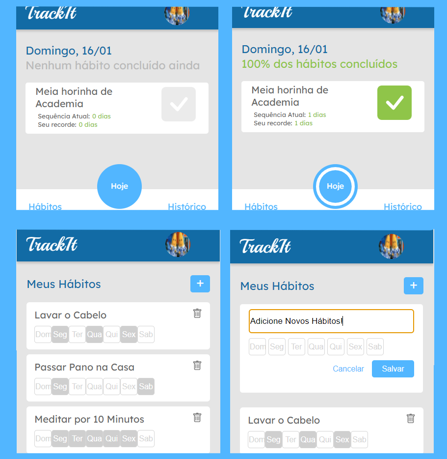

# TrackIt: Criação e Controle de Hábitos!

## Qual a lógica?

A ideia é ter um aplicativo que funcione como uma agenda de hábitos, na qual é possível:

- Cadastrar Hábitos que deseja realizar, incluíndo os dias em que planeja os fazer
- Conferir de forma rápida quais seus hábitos planjeados para o dia bem como os marcar como feitos (ou não)
- Acompanhar seu progresso ao longo do dia!
<figure>

<figcaption align = "center"><b>Telas referentes ao "hoje" e aos "hábitos"</b></figcaption>
</figure>

## Como Usar?

A forma mais direta é ir direto no link:
<a>https://projeto-driven-track-it.vercel.app/</a>

Mas, se quiser ver melhor as funcionalidade e o código em si, você também pode baixar o repositório para sua máquina, através dos seguintes passos:

1. Clone o repositório
   (se não souber como, confira: https://docs.github.com/pt/repositories/creating-and-managing-repositories/cloning-a-repository)

2. Instale as dependências necessárias (no caso, digitar "npm install" na pasta onde clonou o repositório deverá ser suficiente)

3. Depois de instaladas, basta digitar "npm start" no terminal, e o aplicativo será iniciado no seu navegador!

4. Com o aplicativo iniciado, faça seu cadastro (on login), com nome, senha, email e foto de perfil (que deverá ser no formato URL), e ai é só começar a usar o aplicativo!

## E como ele foi feito?

O aplicativo TrackIt foi criado usando:

- [React-Native](https://facebook.github.io/react-native/)

- [React-Navigation](https://reactnavigation.org/docs/en/getting-started.html)

- [Axios](https://github.com/axios/axios)

- [Prettier](https://prettier.io/) -

- [Styled-Components](https://www.styled-components.com/)
